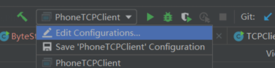

## 题目
* Large file(video) communication based on TCP and UDP,comparing the consumed time 
* IP phone
    * Dialing :TCP
    * Audio: UDP

## 说明
* 第一题在basicSocket包里，第二题在ipPhone包里
* 同时在idea开启客户端和服务端需要开启如下设置
    

    
